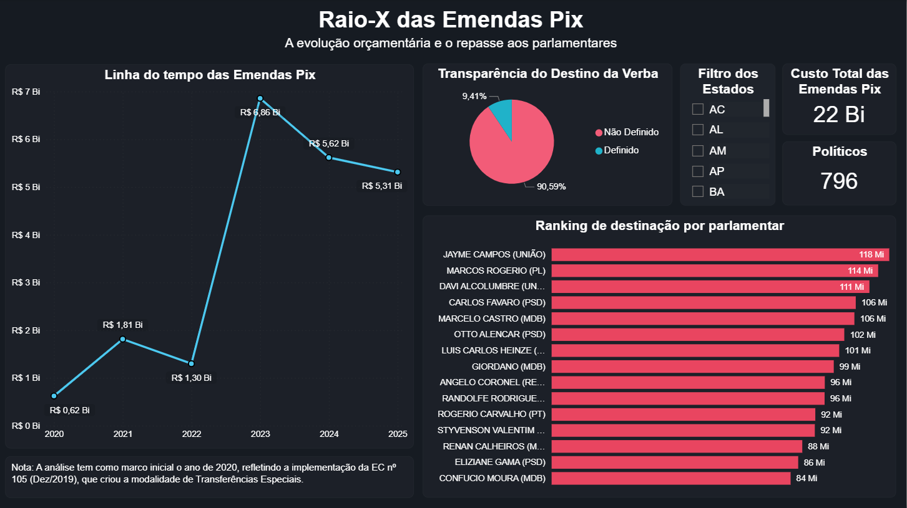
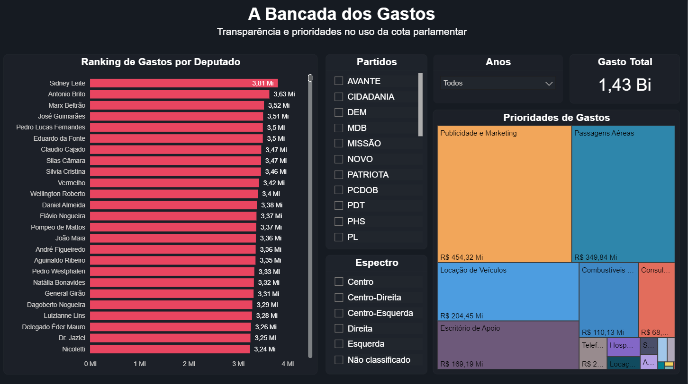
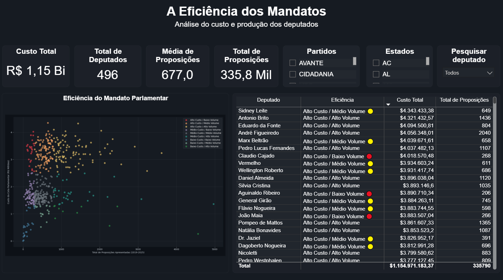
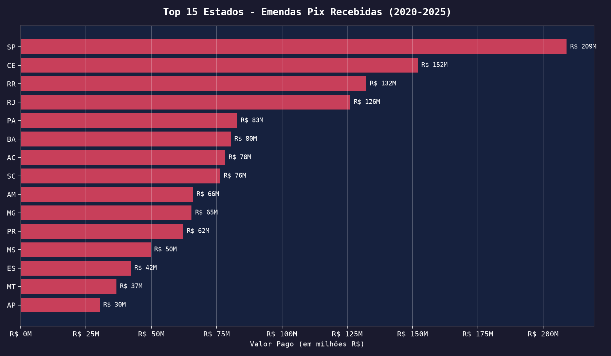
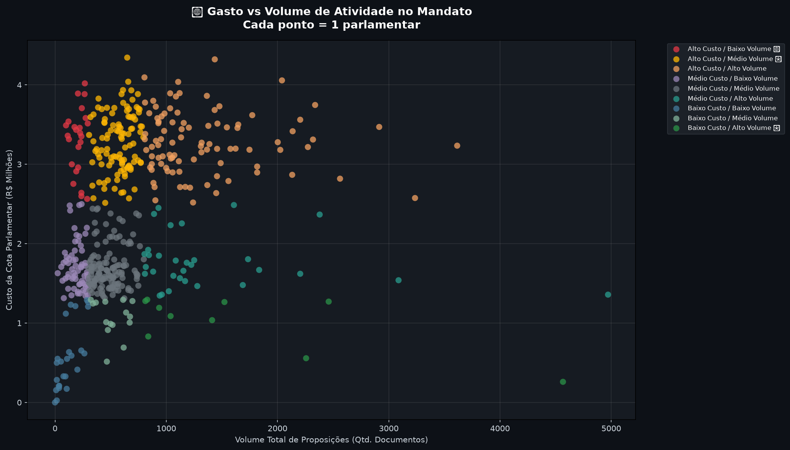

# 👁️ Congresso em Dados
### Um portfólio de análise sobre transparência parlamentar brasileira (2019–2025)
 
> Desenvolvido como portfólio para a área de dados, com foco em civic tech e transparência pública. Inspirado no site do [De Olho em Você](https://deolhoemvoce.com.br).
 
**Autor:** Pedro Solon Assis 
**Formação:** Relações Internacionais | Analista de Dados
**Stack:** Python · SQL · DuckDB · Pandas · Power BI
 
---

## Prévia dos Dashboards
 
| Projeto 1 | Projeto 2 | Projeto 3 |
|:---:|:---:|:---:|
|  |  |  |
| Raio-X das Emendas Pix | A Bancada dos Gastos | A Eficiência dos Mandatos |
 
---
 
## Números que este projeto revela
 
| # | Achado | Valor |
|---|---|---|
| 1 | Total em emendas Pix analisadas (2020–2025) | **R$ 22 bilhões** |
| 2 | Percentual sem rastreabilidade de destino | **90,6%** |
| 3 | Total gasto em cotas parlamentares (2019–2025) | **R$ 1,43 bilhão** |
| 4 | Fatia da cota destinada a publicidade e marketing | **31,8%** |
 
---
 
## Sobre este repositório
 
Este repositório reúne três projetos de análise de dados, todos construídos sobre fontes públicas do governo federal brasileiro. Cada projeto responde a uma pergunta diferente sobre como os parlamentares brasileiros utilizam os recursos públicos e cada resposta levanta uma nova pergunta, que o projeto seguinte tenta responder.
 
A lógica da sequência é esta:
 
**Projeto 1** pergunta: *para onde vai o dinheiro das emendas Pix?*  
**Projeto 2** pergunta: *como os deputados gastam a própria cota de gabinete?*  
**Projeto 3** pergunta: *esse gasto se traduz em trabalho legislativo?*
 
Juntos, os três projetos cobrem os dois principais fluxos de recursos parlamentares - o dinheiro que os deputados **enviam para seus redutos eleitorais** (emendas) e o dinheiro que eles **gastam com a própria estrutura de trabalho** (CEAP) - e tentam confrontar esse custo com o que é efetivamente produzido dentro do Congresso.
 
---
 
## Estrutura do Repositório
 
```
congresso-em-dados/
│
├── 01_emendas_pix/
│   ├── 01_coleta_emendas.py          # Coleta via API do Portal da Transparência
│   └── 02_analise_emendas.py         # Análise por estado, parlamentar e evolução histórica
│
├── 02_cota_parlamentar/
│   ├── 04_coleta_cotas.py            # Download CSV.zip anuais + API de deputados
│   └── 05_analise_cotas.py           # Limpeza, espectro ideológico e visualizações
│
├── 03_eficiencia_mandatos/
│   └── 07_analise_custo_mandato.py   # Coleta de proposições via API + correlação custo/produção
│
├── outputs/                          # Datasets e gráficos gerados pelos scripts
├── dashboard_powerbi/                # Arquivos .pbix dos dashboards interativos
├── requirements.txt
└── README.md
```
 
---
 
## Stack Tecnológica
 
| Ferramenta | Uso |
|---|---|
| `requests` | Consumo das APIs REST do Portal da Transparência e da Câmara |
| `pandas` | Limpeza, transformação e exportação dos dados |
| `DuckDB` | Queries SQL inline sobre DataFrames para agregações e rankings |
| `matplotlib` / `seaborn` | Visualizações estáticas em tema escuro |
| `Power BI` | Dashboards interativos com filtros por partido, estado e ano |
| `Parquet` | Formato de armazenamento intermediário para volumes maiores |
 
---
---
 
# Projeto 1: Raio-X das Emendas Pix
### Poder orçamentário e rastreabilidade no Congresso (2020–2025)
 
## O que são as Emendas Pix?
 
As **Emendas Pix** são uma modalidade de emenda parlamentar criada pela Emenda Constitucional nº 105/2019. Diferente das emendas tradicionais, elas permitem que parlamentares transfiram recursos diretamente para estados e municípios **sem vinculação obrigatória a um programa ou finalidade específica**. Ou seja, o dinheiro chega ao destino e a prefeitura decide como gastar, sem prestação de contas direta ao parlamentar que enviou.
 
O nome "Pix" é informal, mas ilustra bem o mecanismo: rápido, direto e com rastreabilidade limitada.
 
## Dados e Metodologia
 
| Item | Detalhe |
|---|---|
| **Fonte** | API do Portal da Transparência (`api.portaldatransparencia.gov.br/api-de-dados/emendas`) |
| **Período** | 2020 a 2025 (marco inicial: implementação da EC 105/2019) |
| **Tipo de emenda** | Transferências Especiais (filtro `tipoEmenda`) |
| **Registros coletados** | 4.430 emendas |
| **Total pago** | R$ 22 bilhões |
 
## Resultados e Análise Crítica
 
### 1. Crescimento explosivo
 
| Ano | Total Pago | Emendas |
|---|---|---|
| 2020 | R$ 0,62 bilhões | 200 |
| 2021 | R$ 1,81 bilhões | 635 |
| 2022 | R$ 1,30 bilhões | 848 |
| 2023 | R$ 6,86 bilhões | 1.095 |
| 2024 | R$ 5,62 bilhões | 906 |
| 2025 | R$ 5,31 bilhões | 746 |
 
O crescimento de 2020 a 2023 representa um aumento de aproximadamente **+1.006%** em apenas 3 anos. Mas o dado mais revelador é a **queda de 2022**: o volume caiu de R$ 1,81 bilhões para R$ 1,30 bilhões mesmo com o número de emendas crescendo. A explicação está no calendário político, pois 2022 foi ano eleitoral e a distribuição de recursos enfrentou maior escrutínio público e judicial após as investigações sobre o "orçamento secreto" (RP9). O dinheiro recuou temporariamente antes de explodir em 2023, após a posse do novo governo.
 
Isso sugere que o volume das Emendas Pix responde menos à necessidade das localidades beneficiadas e mais ao **contexto político e eleitoral do momento**.


*Dashboard interativo com linha do tempo, transparência do destino e ranking por parlamentar.*

---
 
### 2. O problema da transparência: 90,5% do valor sem destino rastreável
 
Do total de **R$ 22 bilhões pagos**:
 
- Apenas **R$ 2,02 bilhões (9,4%)** possui UF de destino claramente identificada na base de dados.
- Os outros **R$ 19,6 bilhões (90,6%)** estão registrados com localidade genérica ou sem identificação de estado.
Na prática, é possível saber **quem enviou** o dinheiro (o parlamentar), mas não **para onde exatamente foi**.
 
Isso não é um bug da coleta, mas sim uma limitação estrutural da própria API e do sistema de registro das Emendas Pix, que frequentemente registra o destino como o nome do município completo sem sigla de estado padronizada, dificultando o agrupamento geográfico automatizado.

---
 
### 3. Concentração: 205 parlamentares controlam metade do orçamento
 
Com 796 parlamentares únicos identificados no período, os **205 que mais distribuíram emendas (24,6% do total)** concentram **50% dos R$ 22 bilhões**.
 
Os 5 maiores destinadores individuais:
 
| Parlamentar | Partido | Total Pago |
|---|---|---|
| Jayme Campos | União | R$ 118,3 milhões |
| Marcos Rogério | PL | R$ 114,3 milhões |
| Davi Alcolumbre | União | R$ 111,3 milhões |
| Carlos Favaro | PSD | R$ 106,5 milhões |
| Marcelo Castro | MDB | R$ 106 milhões |
 
É importante ressaltar que as Emendas Pix não são instrumentos de um grupo político específico, mas um mecanismo estrutural do Congresso como um todo, utilizado independente da filiação ideológica. Esse achado conecta diretamente ao Projeto 2, que investiga se os mesmos parlamentares que mais distribuem emendas também são os que mais gastam na própria estrutura de trabalho.
 
---

### 4. Distribuição geográfica
 
Entre as emendas com UF identificada, os estados que mais apareceram como destino foram SP, CE, RR, RJ e BA. A presença de **Roraima (RR)** - estado com a menor população do Brasil - entre os maiores beneficiados é um ponto que merece investigação mais aprofundada, possivelmente ligado à concentração de mandatos de senadores com grande volume de emendas.


*Valor total pago em Emendas Pix por estado (2020–2025), em milhões de reais.*

---
 
### 5. Limitações desta análise
 
**Amostragem incompleta:** os 4.430 registros coletados representam uma amostra do universo total. A API do Portal da Transparência registra um volume consideravelmente maior quando consultada pela interface web (estimativa: R$ 30B+ para o período). A diferença pode ser atribuída a filtros da paginação e ao parâmetro `tipoEmenda`, que pode não capturar todas as submodalidades.
 
**Destino geográfico limitado:** o campo `localidadedogasto` não segue um padrão único, ás vezes registra "Município - UF", outra vez registra apenas o nome do município ou usa categorias genéricas como "Nacional". Isso dificulta a análise geográfica agregada.
 
**Sem dados de execução municipal:** a análise mostra **quanto foi transferido**, mas não **o que foi feito com o dinheiro** no destino. A prestação de contas fica a cargo dos estados e municípios perante o TCU, não do parlamentar que enviou. Ironicamente, isso é parte do problema de transparência que o projeto busca evidenciar.
 
---
---
 
# Projeto 2: A Bancada dos Gastos
### Transparência e prioridades no uso da Cota Parlamentar (CEAP) - 2019 a 2025
 
O Projeto 1 mostrou para onde os parlamentares **enviam** o dinheiro público. Este projeto vira a câmera para dentro do Congresso e pergunta: **como eles gastam os recursos destinados à própria estrutura de trabalho?**
 
## O que é a Cota Parlamentar?
 
A **Cota para o Exercício da Atividade Parlamentar (CEAP)** é um benefício concedido a cada deputado federal para cobrir despesas do exercício do mandato, como: passagens, aluguel de escritório, combustível, material de divulgação e entre outros. O valor mensal varia por estado de origem, entre R$ 30 mil e R$ 45 mil, e **não precisa ser devolvido caso não seja utilizado integralmente**.
 
## Dados e Metodologia
 
| Item | Detalhe |
|---|---|
| **Fonte principal** | CSV.zip anual da Câmara dos Deputados (`camara.leg.br/cotas/Ano-{ano}.csv.zip`) |
| **Fonte secundária** | API REST Dados Abertos da Câmara (`dadosabertos.camara.leg.br/api/v2/deputados`) |
| **Período** | 2019 a 2025 (3 legislaturas parciais) |
| **Total gasto analisado** | R$ 1,43 bilhão |
 
### Decisões técnicas relevantes
 
**Tratamento de encoding duplo:** Os arquivos da Câmara misturam UTF-8 e Latin-1 dependendo do ano. O script tenta UTF-8 primeiro e faz fallback para Latin-1 com recodificação forçada linha a linha.
 
**Padronização histórica de partidos:** Partidos que mudaram de nome ao longo do período (PMDB→MDB, PRB→Republicanos, PPS→Cidadania, por exemplo) foram unificados para permitir comparação longitudinal consistente.
 
**Normalização de categorias:** As 20 categorias originais da CEAP foram consolidadas em 15 grupos temáticos via matching de substrings, com blindagem contra variações de encoding (ex: `AÉREA` e `AÃREA` mapeiam para o mesmo grupo).
 
## Resultados e Análise Crítica
 
### 1. Onde vai o dinheiro: as 4 categorias que explicam 82% dos gastos
 
| Categoria | Total (2019–2025) | % do total |
|---|---|---|
| **Publicidade e Marketing** | R$ 454,3 milhões | 31,8% |
| **Passagens Aéreas** | R$ 349,8 milhões | 24,5% |
| **Locação de Veículos** | R$ 204,5 milhões | 14,3% |
| **Escritório de Apoio** | R$ 169,2 milhões | 11,8% |
| Combustíveis | R$ 110,1 milhões | 7,7% |
| Consultorias e Pesquisas | R$ 68,0 milhões | 4,8% |
| Demais categorias | R$ 74,1 milhões | 5,2% |
 
O dado mais crítico é o primeiro: **publicidade e marketing respondem por quase 1/3 de todo o gasto da CEAP**. Na média, cada um dos 513 deputados gastou aproximadamente R$ 886 mil em divulgação ao longo do período. Esse valor, na prática, inclui publicidade em redes sociais e produção de conteúdo muitas vezes indistinguível de campanha eleitoral antecipada. A **CEAP não tem vedação explícita a gastos que coincidem com períodos pré-eleitorais**.


*Ranking individual por deputado, filtros por partido e espectro ideológico, e mapa de prioridades de gastos.*

---
 
### 2. O ranking individual: dispersão baixa, volumes altos
 
Os 25 deputados no topo do ranking - que representam apenas **4,9% da Câmara** - somaram aproximadamente R$ 88 milhões no período. A diferença entre o 1º colocado (Sidney Leite, PSD-AM, R$ 3,81M) e o 25º (Nicoletti, PL-RR, R$ 3,24M) é de apenas **17,6%**, revelando um padrão estrutural: o problema não é um parlamentar gastando dez vezes mais que os outros, mas um grupo significativo operando consistentemente próximo ao teto permitido.
 
É importante ressaltar que parlamentares do Norte e Nordeste tendem a ter maiores custos com descolocamento, porém é imprescindível a transparência do valores utilizados para cobrir esses benefícios.

---
 
### 3. O que os dados não mostram e por que isso importa
 
A CEAP cobre o *quanto* foi gasto e *em quê*. O que ela não informa:
 
**Resultado do gasto:** Um deputado que gastou R$ 3 milhões pode ter entregado um mandato mais produtivo do que um que gastou R$ 1 milhão. Custo alto não é sinônimo de desperdício. Essa pergunta, a mais importante, é exatamente o que o Projeto 3 tenta responder.
 
**Qualidade dos fornecedores:** A CEAP registra o CNPJ do fornecedor, mas não avalia se o serviço foi entregue, se o preço foi compatível com o mercado ou se há vínculos entre o fornecedor e o gabinete. Análises mais avançadas de integridade cruzam o CNPJ com bases de empresas inativas ou com sócios relacionados ao parlamentar.
 
**Devolução voluntária:** Alguns deputados devolvem parte do saldo não utilizado ao erário. O número dos custos representa o *utilizado*, não o *aprovado*.
 
---
---
 
# Projeto 3: A Eficiência dos Mandatos
### Custo da cota parlamentar versus produção legislativa (2019–2025)
 
O Projeto 2 revelou quanto cada deputado gasta na cota parlamentar. Este projeto fecha o ciclo com a pergunta mais difícil: **Esse gasto se converte em trabalho legislativo?**
 
Para isso, cruzamos o custo total acumulado de cada parlamentar na CEAP com o volume de proposições que cada um apresentou à Câmara no mesmo período e classificamos cada mandato em 9 faixas de eficiência, do **Alto Custo / Baixo Volume 🔴** ao **Baixo Custo / Alto Volume 🟢**.
 
## Dados e Metodologia
 
| Item | Detalhe |
|---|---|
| **Fonte Custo** | `cotas_parlamentares.parquet` gerado pelo Projeto 2 |
| **Fonte Produção** | API Dados Abertos da Câmara (`/api/v2/proposicoes`) |
| **Período** | 2019 a 2025 |
| **Parlamentares analisados** | 496 |
| **Custo total analisado** | R$ 1,15 bilhão |
| **Total de proposições** | 335.790 documentos |
| **Média por parlamentar** | 677 documentos |
 
### Como a produção legislativa é medida
 
O script consulta o endpoint `/api/v2/proposicoes` com o parâmetro `idDeputadoAutor` para cada deputado e acumula o total retornado pelo header `X-Total-Count`, sem fazer download das proposições, apenas contando. Uma requisição por deputado por ano, com `time.sleep(0.5)` entre chamadas para respeitar o rate limit da API.
 
**Importante:** "Proposições" abrange **todo tipo de documento** que o parlamentar assina como autor, como: projetos de lei, requerimentos, indicações, emendas a projetos alheios, recursos e entre outros. Não é um índice exclusivo de PLs originais, o que tem implicações analíticas relevantes discutidas abaixo. Ou seja, **o projeto não tem como mensurar a importância de cada proposição, ainda mais sendo algo relativo, mas sim visa ter uma dimensão do uso do dinheiro público pelos representates do povo.**
 
### Faixas de classificação
 
| Dimensão | Faixa | Critério |
|---|---|---|
| Custo | Baixo | ≤ R$ 1,3M |
| Custo | Médio | R$ 1,3M – R$ 2,5M |
| Custo | Alto | > R$ 2,5M |
| Volume | Baixo | < 300 documentos |
| Volume | Médio | 300 – 800 documentos |
| Volume | Alto | > 800 documentos |
 
## Resultados e Análise Crítica
 
### 1. O problema estrutural: quase todos são "Alto Custo"
 
O primeiro dado que chama atenção no dashboard é a concentração de classificações "Alto Custo" no topo da tabela. Isso não é casualidade, é um **efeito direto da calibração das faixas**.
 
A faixa "Alto Custo" começa em R$ 2,5M, mas a **média geral do conjunto é R$ 2,33M**. Seis anos de CEAP com teto mensal de até R$ 45 mil já colocam naturalmente a maioria dos deputados próxima ou acima desse limiar. Isso dilui o poder discriminatório da classificação, quando quase todos estão no mesmo quadrante de custo, a variável que diferencia os mandatos passa a ser exclusivamente o volume de proposições.


*Classificação de 496 deputados em 9 faixas de eficiência, com filtros por partido e estado.*

---
 
### 2. O achado central: diferença de 9,5x no custo por proposição
 
Entre os deputados mais caros do ranking, a dispersão de produtividade é enorme:
 
| Deputados | Partido | UF | Custo Total | Proposições | R$/Proposição |
|---|---|---|---|---|---|
| Sidney Leite | PSD | AM | R$ 4,34 milhões | 649 | R$ 6.693 |
| Antonio Brito | PSD | BA | R$ 4,32 milhões | 1.436 | R$ 3.009 |
| Eduardo da Fonte | PP | PE | R$ 4,09 milhões | 804 | R$ 5.093 |
| André Figueiredo | PDT | CE | R$ 4,06 milhões | 2.040 | R$ 1.988 |
| Claudio Cajado | PP | BA | R$ 4,02 milhões | 268 | R$ 14.995 |
| João Maia | PP | RN | R$ 3,88 milhões | 266 | R$ 14.600 |
| Aguinaldo Ribeiro | PP | PB | R$ 3,89 milhões | 206 | R$ 18.887 |
 
André Figueiredo (PDT-CE) apresentou **2.040 proposições** ao custo de R$ 1.988 por documento. Aguinaldo Ribeiro (PP-PB) apresentou **206 proposições** ao custo de R$ 18.887 por documento, **9,5 vezes mais caro por proposição**, com gasto absoluto praticamente idêntico.

---
 
### 3. O padrão PP: três deputados no quadrante vermelho
 
Dos deputados classificados como **Alto Custo / Baixo Volume 🔴**, três pertencem ao **PP** (Progressistas): Claudio Cajado (BA), Aguinaldo Ribeiro (PB) e João Maia (RN). Os três acumulam mais de R$ 11,7M em CEAP combinados e juntos apresentaram apenas 740 proposições, média de 247 por parlamentar.
 
Isso não implica necessariamente ineficiência: pode refletir um estilo de atuação mais voltado à articulação política e negociação de emendas do que à apresentação de documentos formais. Os três são lideranças do PP com mandatos longos, e o PP historicamente, concentra deputados com alto volume de Emendas Pix (como vimos no Projeto 1).

---
 
### 4. O scatter plot revela uma nuvem, não uma correlação
 
O gráfico de dispersão mostra um padrão importante: **não há correlação clara entre custo e produção**. A nuvem de pontos está dispersa em todas as direções. O valor que um deputado gasta na cota parlamentar não prediz quantas proposições ele vai apresentar. Logo, os dois fenômenos são, em grande medida, independentes.
 
O que o custo da CEAP reflete são principalmente fatores logísticos (distância de Brasília, custo de vida no estado de origem) e de estilo político. A produção legislativa depende de fatores completamente distintos: perfil do deputado, agenda política, pertencimento a comissões, alinhamento com o governo e entre outros.


*Cada ponto representa um deputado. A ausência de correlação clara entre custo e produção é o ponto do Projeto 3.*

---
 
### 5. Limitações críticas desta análise
 
**Volume ≠ qualidade legislativa.** Um requerimento de informação e um projeto de lei que se torna lei são contados igualmente como "1 proposição". A API da Câmara permite filtrar por tipo de proposição, uma extensão natural deste trabalho seria desagregar o total em PLs, PDCs, requerimentos e emendas para uma análise mais granular.
 
**Mandatos parciais distorcem o ranking.** Suplentes que assumiram no meio da legislatura têm menos anos acumulados de CEAP e de proposições, posicionando-se artificialmente nas faixas de "Baixo". Uma normalização por meses de mandato seria mais justa.
 
**A CEAP não captura o custo total do mandato.** Salários, benefícios e funcionários comissionados não entram na CEAP. O custo real de um mandato é consideravelmente maior do que o que esta análise mede.
 
---
 
## Extensões Futuras para os Três Projetos
 
Os três projetos foram desenhados para se complementar, e a extensão mais natural seria **unificar as três dimensões em uma análise única por parlamentar**: quanto ele destinou em emendas Pix (Projeto 1), quanto gastou na própria estrutura (Projeto 2) e quanto produziu legislativamente (Projeto 3). Esse cruzamento daria um perfil de mandato mais completo do que qualquer uma das três análises consegue oferecer individualmente.
 
Outras extensões relevantes:
 
**Desagregação por tipo de proposição:** Separar PLs originais de requerimentos e emendas daria um índice de produção legislativa mais qualificado que o volume bruto atual.
 
**Análise temporal das emendas Pix por ciclo eleitoral:** Testar formalmente a hipótese de que o volume de emendas aumenta nos anos eleitorais.
 
---
 
## Fontes de Dados
 
- [Portal da Transparência - Emendas Parlamentares](https://portaldatransparencia.gov.br/emendas)
- [EC 105/2019 - Emendas Pix](https://www.planalto.gov.br/ccivil_03/constituicao/emendas/emc/emc105.htm)
- [Câmara dos Deputados - Dados de Cotas](http://www.camara.leg.br/transparencia/gastos-parlamentares)
- [Portal de Dados Abertos da Câmara](https://dadosabertos.camara.leg.br)
- [Siga Brasil - Senado Federal](https://www12.senado.leg.br/orcamento/sigabrasil)
- [De Olho em Você - Transparência Parlamentar](https://deolhoemvoce.com.br)
---
 
*Todos os dados são públicos e foram obtidos de fontes governamentais oficiais.*
